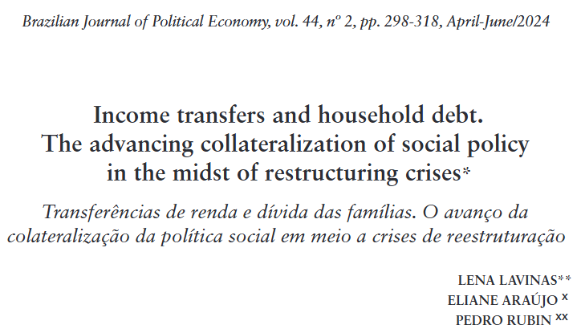
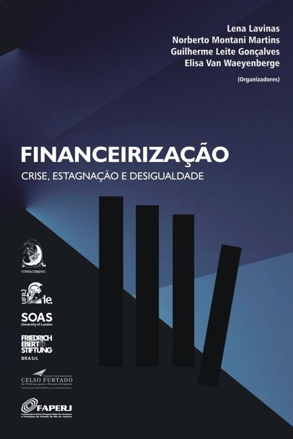

Olá, sou o Pedro Rubin.

Tenho mestrado em economia pelo PPGE - UFRJ e sou consultor da Macroplan Consultoria e Analytics, na área de estudos e dados.

Também sou pesquisador em financeirização e política social, com a professora Lena Lavinas.

Lista completa de trabalhos [aqui](https://pedrorubin.github.io/pedro-rubin/research.html)

[Income transfers and household debt. The advancing collateralization of social policy in the midst of restructuring crises.](https://bjpe.org.br/repojs/index.php/journal/article/view/2455), *with Lena Lavinas and Eliane Araújo, 2024*

[CAPÍTULO XXVII - A FINANCEIRIZAÇÃO DA PRIVAÇÃO: OS POBRES POR DÍVIDA](https://www.editoracontracorrente.com.br/product/financeirizacao-crise-estagnacao-e-desigualdade) *2024*

